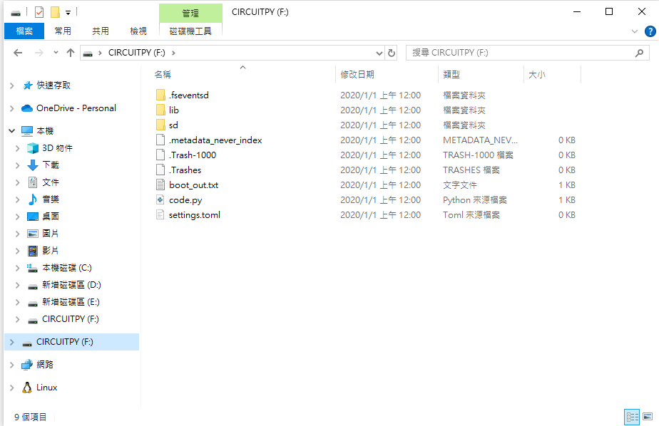

# school_project_BadUSB_rapi

## tutorial

### 設定的檔案存在資料夾 `setup` 中

#### build up

- 在接上 `USB` 前壓住 `BOOTSEL`，直到接上`USB`。
- 會進入一個樹苺派的資料夾並且可以讓你丟資料，把 `adafruit-circuitpython-raspberry_pi_pico_w-en_US-9.1.4.uf2` 直接丟進去
    - 理論上成功之後會變成這樣   
- 如果失敗就把  `flash_nuke.uf2` 先丟到資料夾上，然後再丟 `adafruit-circuitpython-raspberry_pi_pico_w-en_US-9.1.4.uf2`
- 成功之後，先丟 `boot.py` 進去資料夾，再接者丟 `lib`、`code.py`、`duckyinpython.py`、`secrets.py`、`webapp.py`、`wsgiserver.py` 
- 之後接上跳線在 `gpio 0` 跟 `gnd` 上
- 修改 `payloads.dd` ，如果完成之後便把 `USB` 拔掉加上拔跳線

#### usage

- 把 `USB` 直接插上去就可以用了喔 owob

## payload

### payloads 的檔案存放在資料夾 `payloads` 中

## Reference:

https://github.com/dbisu/pico-ducky
